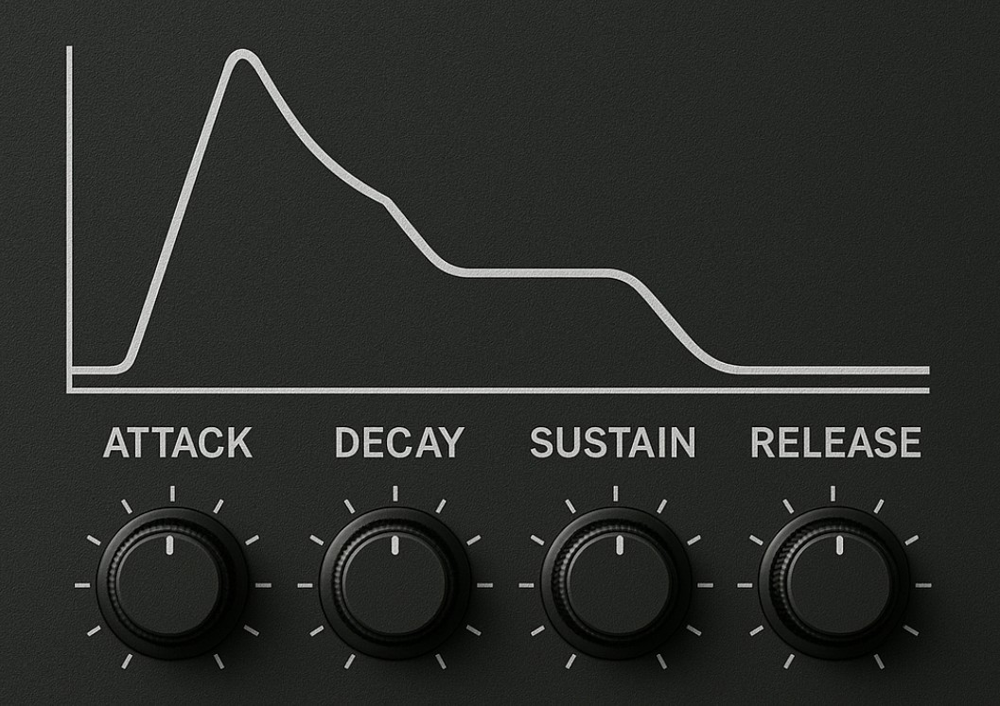

# ADSR for Pure Data with 5 phases:

* Startup: returns from current envelope to 0 within 3ms on start
* Attack: convex, concave oder linear fom 0 to 1
* Decay: falls to sustain level
* Sustain: hold until stop is triggered
* Release: convex, concave oder linear from current envelope level to 0